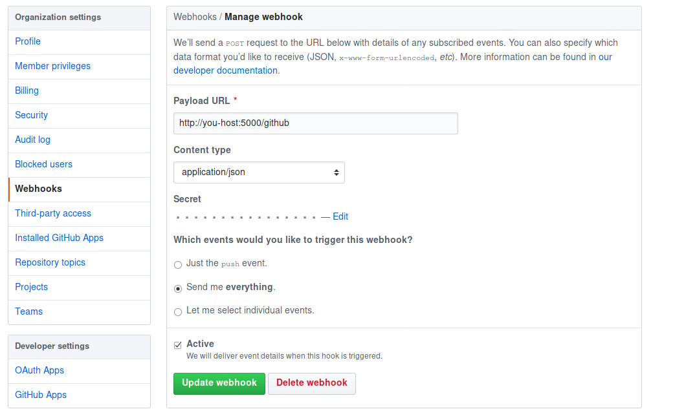

# hub2coolq
[](https://travis-ci.org/JRT-FOREVER/hub2coolq)

> Github webhook 消息转发至qq群

使用coolq 的api接口
[Coolq Api](https://github.com/richardchien/coolq-http-api)

使用coolq 的api接口python 的库
[coolq python SDK](https://github.com/richardchien/cqhttp-python-sdk)

### Install
```sh
pip3 install -r requirements.txt --user
```

### Config
```sh
cp config-dist.py config.py
```

### Test && Run
```sh
FLASK_APP=hub2coolq.py python3 -m flask run
```


## 关于部署
推荐用gunicorn3 然后用`deploy.sh` 启动：默认端口 8234

配置nginx 代理gunicorn3 的端口

尽量不要使用gunicorn3 直接对外


#### github 配置
github webhook 分组织和仓库两种



## 这个项目最开始是用php写的，后来用python3 重构
在old_php 下的旧版的

### 依赖
php-curl

### 配置
```sh
cp config-dist.php config.php
```


### 参考文档

[Github webhook](https://developer.github.com/webhooks/)


### Todo

- [ ] Github webhook token support
- [ ] Event Summary
